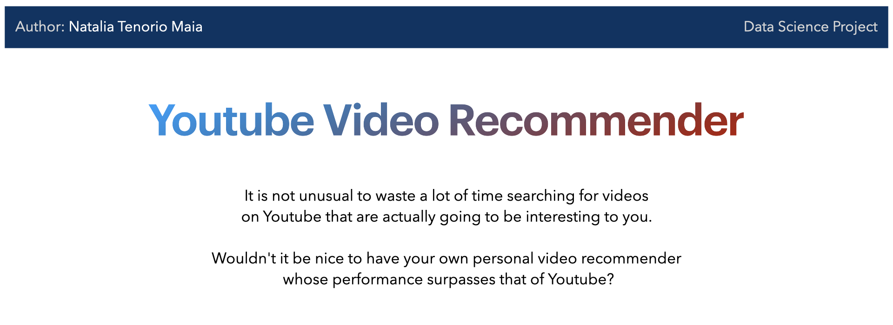
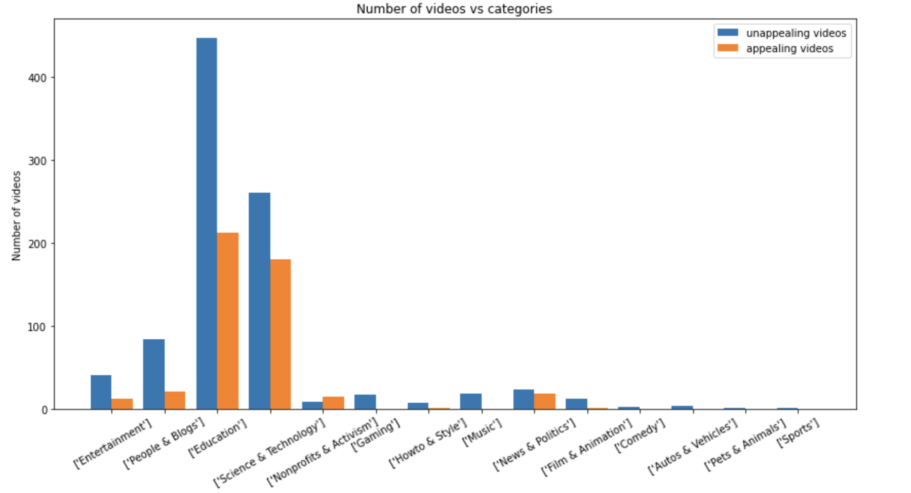
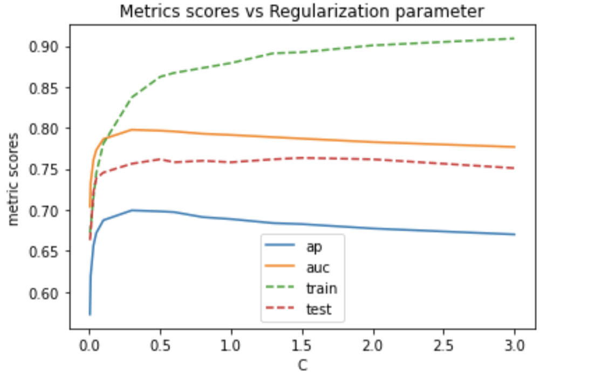

# 1. Introduction

In this project, I built a [web application](https://stormy-lake-83008.herokuapp.com) which recommends to me Youtube videos that suit my personal taste on the topics of artificial intelligence, machine learning and deep learning. The recommendations are displayed in descending order of appeal, and the videos can be accessed by clicking on the titles. The final product, therefore, is a data science solution to the problem of wasting time on Youtube searching for videos that are appealing to me.

The main motivation to work on this solo project was to create a complete data science solution, starting from the data extraction and preparation, followed by the construction of the machine learning algorithm, and finalizing by deploying the model in production. Building this project endowed me with the skills needed to independently work on all the different stages in the construction of a complete data science solution.

To check how I did all the steps necessary to build the machine learning model, go to the folder *notebooks* where all the jupyter notebooks containing the Python codes can be found. All the files related to the web application, in turn, can be found in the folder *deploy*. Furthermore, those who want to learn in a more comprehensive way how to create a complete data science solution, I recommend Mario Filho's [course](https://www.hotmart.com/product/como-criar-uma-solucao-completa-de-data-science/R21452890L).

In the following, I present a summary of the procedures involved in building this project.

# 2. Data Extraction and Preparation
In order to create a machine learning algorithm capable of recommending the videos which best suit my taste, first I needed to have a dataset to train the model. Thus, I used the package [Youtube-dl](https://youtube-dl.org) to collect data on the Youtube videos related to my favorite topics: artificial intelligence, machine learning and deep learning.

After cleaning the data, I selected the most relevant features that would be used to train the machine learning model. Then, I used macbook's Numbers app to label all the videos as either appealing (y = 1) or unappealing (y = 0). The dataset was composed by 1393 entries, being 462 of them positive examples (appealing videos) and 931 negative (unappealing videos) examples.

Multiple graphs were plotted for data visualization, with the purpose of identifying trends and giving me insights about which features should be engineered in order to build a personal video recommender whose performance is better than Youtube's.

The histogram above is an example of how my decision to label a video as appealing could be somehow related to the category to which the video belongs. Along with the categories feature, other features related to the video's duration,  number of views, likes, dislikes, name of the channel and video's title were engineered to be part of the training dataset.

# 3. Machine Learning Model

After extracting and preparing the training dataset, I trained three different classifiers: [Random Forest](https://scikit-learn.org/stable/modules/generated/sklearn.ensemble.RandomForestClassifier.html), [LightGBM](https://lightgbm.readthedocs.io/en/latest/pythonapi/lightgbm.LGBMClassifier.html) and [Logistic Regression](https://scikit-learn.org/stable/modules/generated/sklearn.linear_model.LogisticRegression.html). The Random Forest parameters were optimized via GridSearch, while for the LightGBM classifier Bayesian optimization was performed. For the Logistic Regression, I used a list of different values for the regularization parameter to help decide on the best choice for that classifier. For example, the graph below shows how the different choices for the regularization parameter affects the performance of the Logistic Regression classifier. In this graph, each curve is related to a different performance metric: *ap* is the average precision and *auc* is the area under the ROC curve, both applied to a test dataset, while *test* is the test accuracy and *train* is the train accuracy.

As building a video recommender is in essence a binary classification problem, in which I am more interested in improving the number of true positives that my model predicts, and because the training dataset I prepared is somewhat imbalanced (the number of negative examples is double that of the positive ones), I used average precision and area under the ROC curve as primary and secondary performance metrics, respectively, when searching for the optimal parameters for the classifiers.

After training and testing the classifiers on the prepared dataset, I compared their performances on unseen, new data. The classifiers assigned scores ranging from 0 (very unappealing) to 1 (very appealing) to the new videos about artificial intelligence, machine learning and deep learning. Although all classifiers perfomed very similarly in the sense of which videos they recommended to me, the LightGBM was the most confident about its recommendations: it assigned higher scores for the videos which it predicted as appealing to me and much lower scores to the videos predicted as unappealing. The Random Forest, on the other hand, was the most uncertain about its recommendations, while Logistic Regression was neither too confident nor too uncertain. By checking how the ensembles of the classifier performed in the new data, the best choice for the predictor to be used in the web application was a combination of the LightGBM and the Random Forest predictions. This predictor is the following weighted average between the predictions of these two classifiers:
$$
p = 0.1p_{rf} + 0.9p_{lgbm}.
$$

# 4. Deploying Model

The last stage of this project was the construction of a web application which would display the results of my video recommender in the browser. Using Flask as the framework, I wrote a Python code to use the trained classifiers on a new dataset of Youtube videos related to the same topics for which the model was trained. Instead of classifying the new videos as being either appealing or unappealing (0 or 1), I chose to keep the predicted appealing scores as a continuous value from 0 to 1. Then, I wrote the application to sort the results in descending order of appealing score and display only the 20 highest scoring videos. Finally, to access any of the recommended videos, I simply have to click on the video's title.

I used [Docker](https://www.docker.com) to build a container for my web application, which is hosted by Heroku. The video recommender application can be accessed in this [link](https://stormy-lake-83008.herokuapp.com).

**Connect with me at [LinkedIn](https://www.linkedin.com/in/natalia-tenorio-maia/)**
